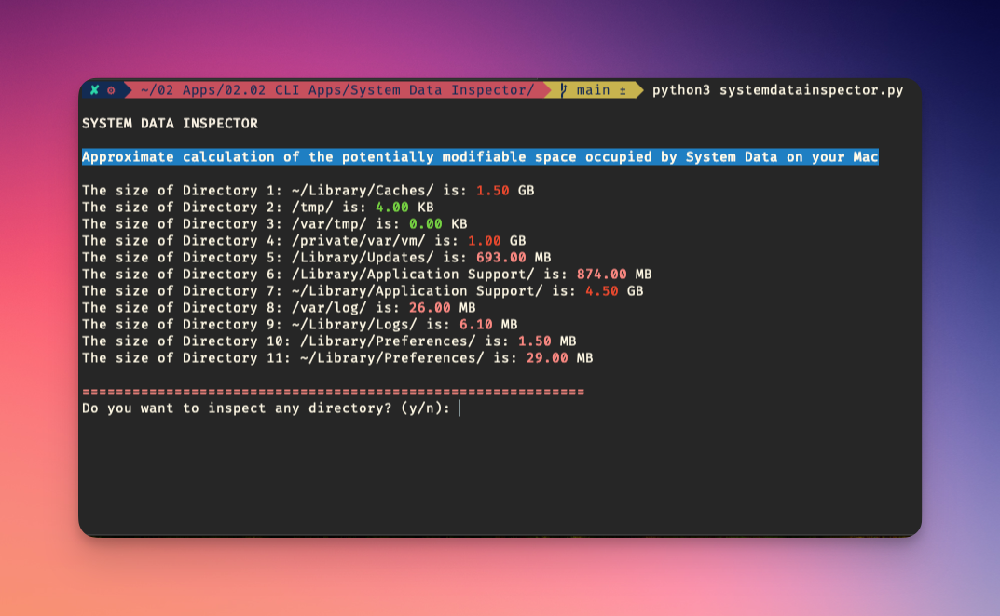

# System Data Inspector


The System Data Inspector for MacOS provides a quick and efficient way to view the approximate calculations of potentially modifiable space occupied by System Data on your Mac. With it, you can view various directories and their sizes.



## Requirements

- MacOS Operating System
- Python 3.x

## Permissions

**Important:** For the program to function correctly, it needs access to the Mac's hard drive.

### Granting Disk Access

To ensure the MacOS System Data Inspector works correctly:

1. Open **System Settings**.
2. Click on **Privacy & Security**.
3. Scroll down and select **Full Disk Access** on the left side.
4. Unlock the settings of the program where you are going to execute the script (usually "Terminal") by clicking the lock icon at the bottom left and entering your password.
5. You may need to restart the Python application or the terminal for the changes to take effect.

## Usage

To run the System Data Inspector in the terminal:

```bash
python3 <path_to_script>/systemdatainspector.py
```

Follow the on-screen prompts to inspect the sizes of various directories and optionally delve deeper into specific directories.

## Features

- View total size for predefined system directories.
- Color-coded size display for better readability.
- Option to inspect individual directories in detail.
- Capability to open inspected directories in Finder.

## Credits

&copy; Alex Arroyo, 2023